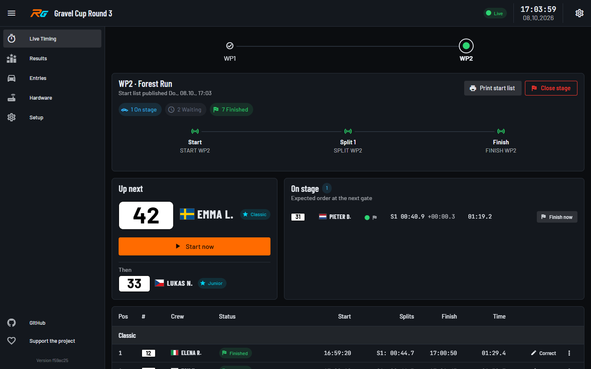
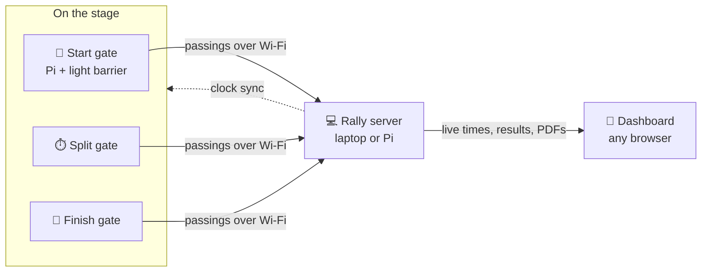
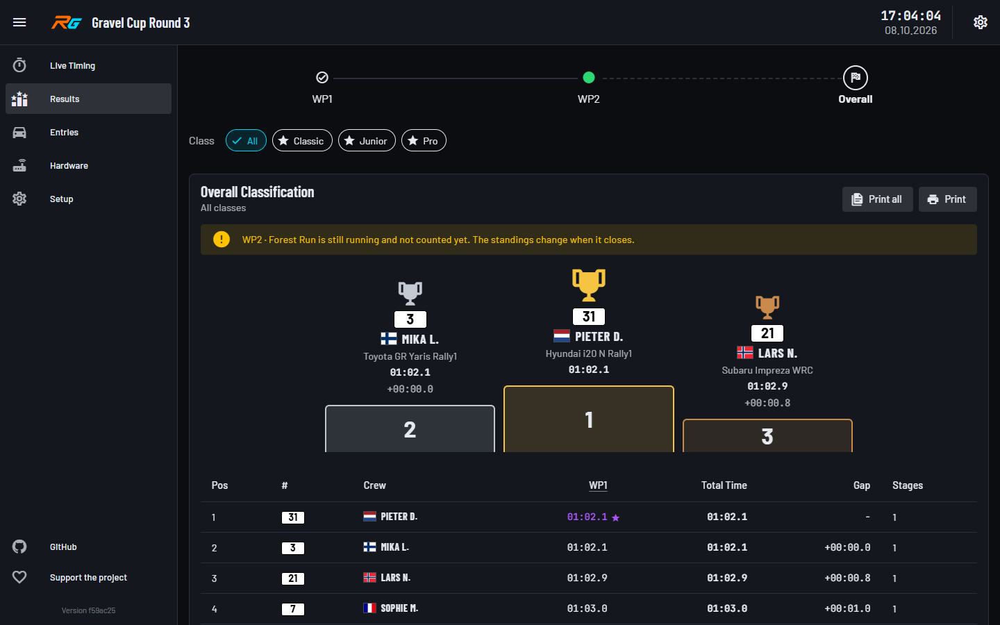
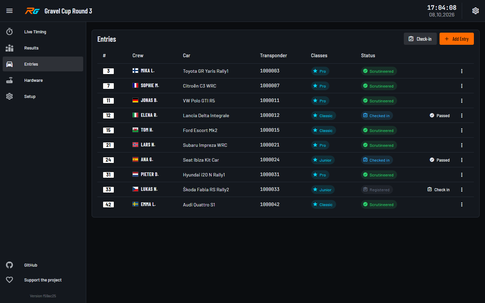
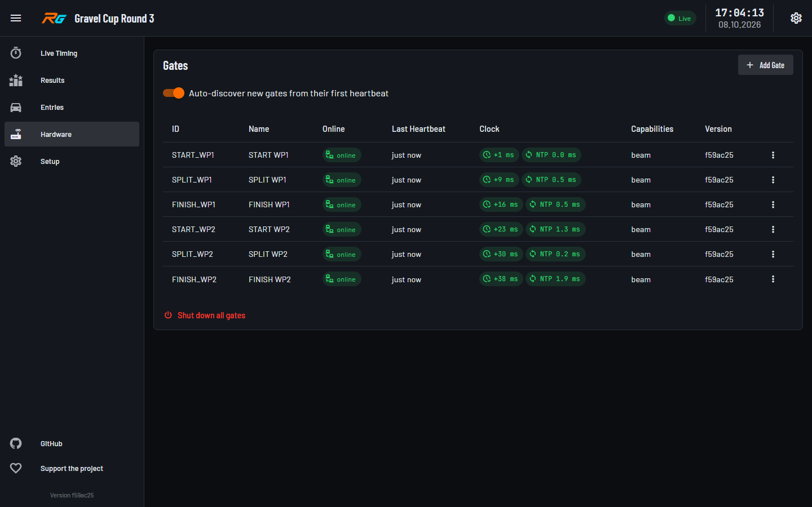

# Rally Gate

Timing for **RC rally events**: special stages timed from start to finish gate,
live on a laptop or tablet at the service park, with results and a stage
classification at the end of the day.

It is built for clubs running a small rally on their own ground: no internet,
no timing company, and hardware a club can build and own. Everything runs on
the rally's own closed Wi-Fi.

> **Status: early development.** Timing works end to end with simulated gates
> and with a light barrier on a gate's GPIO pin; RC transponders aren't
> supported yet (see [What works today](#what-works-today)). Don't time a real
> event without a paper backup.



## How it works



- **A gate is just a sensor.** It reports "something passed at 10:42:13.412"
  and nothing else. Whether it is the start of stage 1, a split or the finish
  of stage 3 is decided on the server, so the same gate can be moved to
  another stage between runs without touching it.
- **The server does the rally.** You set up stages and assign gates to them;
  when a car passes the start and later the finish, it becomes a stage time.
  Several stages can run at once.
- **Gates find the server by themselves** and take their time from it, so
  setting up on the day means switching things on — no IP addresses, no
  configuring gates per event.
- **Marshals keep control.** Live Timing follows the stage in start order:
  who's up next, who's on stage, every passing. A marshal can start or finish
  a car by hand when a gate misses it (marked as hand-timed), correct a time
  or void a run for a re-run. Results update as times come in.
- **One event, one file.** An event is a single file on the server machine:
  copy it to back it up or hand it on. Gates you use regularly are remembered
  and can be picked into the next event.

## What works today

- Stages with start, finish and split gates; stage, split and overall
  classification; DNF/DNS, manual corrections, voided runs and re-runs.
- Entry classes, with rankings per class or combination of classes.
- Results and start lists as PDFs to post or share, every class's ranking
  in one go, on numbered sheets.
- Start lists per stage, ordered by class and start number or by times so
  far, frozen and printed for posting.
- **Light barrier gates**: a Raspberry Pi with a light barrier on a GPIO pin.
  A light barrier can't tell cars apart, so a marshal confirms each passing's
  car on Live Timing, which suggests it from the start order. Verified on a Pi
  with an Omron E3Z-T61.
- Gate clock sync against the server, with offsets shown on the Hardware page.
- A config page on every gate (name, sensor, Wi-Fi); a gate that finds no
  known Wi-Fi opens its own hotspot so you can reach that page.
- Creating and switching events from the dashboard.

| Results | Entries | Hardware |
|---|---|---|
| [](docs/images/results.png) | [](docs/images/entries.png) | [](docs/images/hardware.png) |
| Overall and stage classification, per class, printable | Cars, classes, transponders, check-in and scrutineering | Every gate's heartbeat and clock sync at a glance |

Not yet: **RC transponder decoding** (RC3/RC4, via OpenStint and an SDR —
waiting on working SDR hardware), time controls, Parc Fermé, penalties, and
any login. See
[docs/development-roadmap.md](docs/development-roadmap.md).

## What you need

- **A server:** a laptop (Windows, macOS on Apple Silicon, or Linux), or a
  Raspberry Pi. The dashboard runs in any browser on the same network.
- **Per gate:** a Raspberry Pi with Raspberry Pi OS Lite and a light barrier
  (Omron E3Z-T61, wiring in
  [docs/decoder-adapters.md](docs/decoder-adapters.md)). A DS3231 RTC module is
  optional and keeps the clock across power cuts.
- **A Wi-Fi network** that the server and all gates join. It does not need
  internet access.

## Installation

### Server on a laptop

The standalone package needs nothing else installed: unzip it and
double-click **Rally Gate** (`Rally Gate.cmd` on Windows, `Rally Gate.command`
on macOS, `rally-gate.sh` on Linux). A console window opens — closing it stops
the server — and the dashboard opens in your browser at
`http://localhost:57430`. Event files are kept in `Documents/Rally Gate`.

On first start Windows asks once for permission to open the firewall for the
gates. The package isn't code-signed yet, so Windows SmartScreen and macOS warn
the first time (on macOS: right-click → Open).

No release has been published yet. Until then, build the package yourself
(Node.js 22):

```bash
npm ci
npm run build:shared
npm run build --workspace=@rally-gate/rally-server --workspace=@rally-gate/web
node scripts/package-standalone.js   # -> dist-standalone/
```

### Server on a Raspberry Pi

On a fresh Raspberry Pi OS Lite:

```bash
curl -fsSL https://raw.githubusercontent.com/GerritK/rally-gate/master/deploy/install-server-pi.sh | bash
```

Runs the server with Docker and PostgreSQL. The dashboard is at
`http://rally-server.local:57430`. In this mode the Pi keeps one event;
creating and switching events from the dashboard is standalone-only for now.

### Gates

On each gate's Raspberry Pi:

```bash
curl -fsSL https://raw.githubusercontent.com/GerritK/rally-gate/master/deploy/install-gate-pi.sh | bash
```

It asks for a **gate ID** — pick one prefixed with your club's short code,
like `CLUB_START_WP1`, so gates never clash if clubs share hardware — plus a
hotspot password and whether an RTC module is fitted. Nothing about the rally:
the server address defaults to `rally-server.local`, which the server
announces on the network itself, so press Enter there. Re-run the same command
to update a gate; it offers the current settings as defaults.

Everything else is set on the gate's own config page at
`http://<gate-name>.local:57439`: the sensor, Wi-Fi networks, and a status
panel. Only where the network blocks discovery (some access points do) does a
gate need the server's IP address entered there.

### On the day

1. Start the server and join the rally Wi-Fi with every gate.
2. **Setup** → create the event, then the stages; assign gates as start,
   finish or split. Set how start lists are ordered.
3. **Entries** → register the cars.
4. **Hardware** → check every gate is online and its clock is in sync.
5. **Live Timing** → freeze and print a stage's start list when you post it,
   activate the stage when it starts, close it when the last car is
   through.

## For developers

npm workspaces monorepo, TypeScript throughout:

| | |
|---|---|
| `apps/rally-server` | NestJS: REST API, embedded MQTT broker, time server, mDNS, SQLite or PostgreSQL |
| `apps/web` | Vue 3 + Vuetify dashboard |
| `apps/gate-agent` | runs on a gate; turns sensor readings into detections over MQTT |
| `apps/gate-config` | runs on a gate; its config page |
| `packages/shared` | types shared by all apps |
| `packages/ui` | the shared Vuetify theme and styles |

Development needs no hardware:

```bash
npm install
npm run build:shared         # after every change in packages/shared

npm run dev:server           # API on :57430, MQTT on :57431
npm run seed-demo-data       # a demo stage, gates and an entry
npm run simulate -- --gate START_WP1 --transponder 1234567
npm run simulate -- --gate FINISH_WP1 --transponder 1234567
npm run dev:web              # dashboard on :57440
```

`npm run dev:gate-agent` sends continuous simulated detections instead, and
`docker compose -f deploy/docker-compose.yml -f deploy/docker-compose.dev.yml up`
runs the headless stack with simulated gates.

`npm run screenshots` regenerates the images in `docs/images/` from a
throwaway demo event (after building shared, rally-server and web). It needs
Playwright's Chromium (`npx playwright install chromium`), or set
`SCREENSHOT_CHANNEL=msedge` or `chrome` to use an installed browser.

Before changing an area, read its note in `docs/` — much of the "why" lives
there: [architecture](docs/architecture.md), [event model](docs/event-model.md),
[API](docs/api.md), [deployment modes](docs/deployment-modes.md),
[decoder adapters](docs/decoder-adapters.md),
[frontend](docs/frontend-structure.md), [design system](docs/design-system.md),
[gate config](docs/gate-config-ui.md),
[roadmap](docs/development-roadmap.md). [CLAUDE.md](CLAUDE.md) has the
commands, checks CI runs, and the codebase's standing rules. The original
vision document is in [ideas/](ideas/RC_Rally_Timing_Project_Documentation.md).
